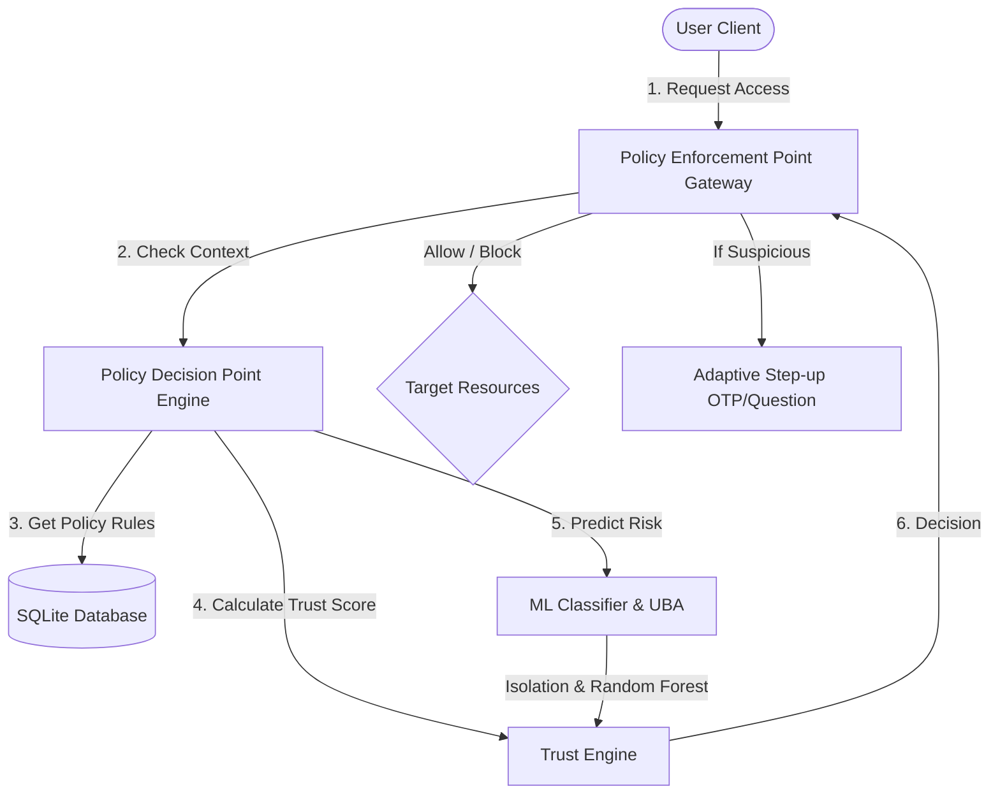
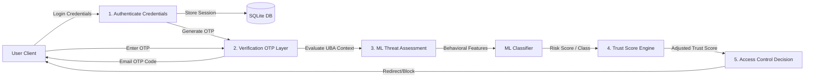
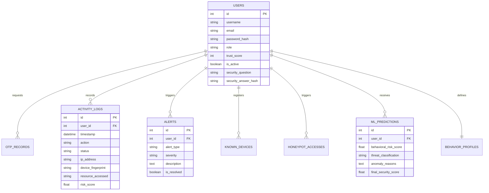
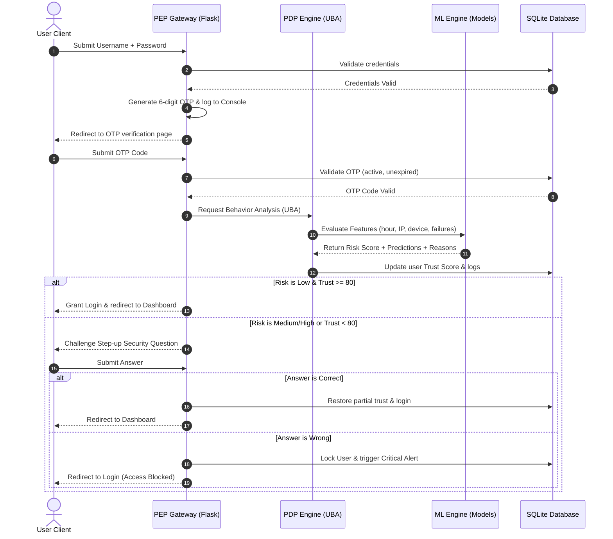

# Final Year Project Report
## Zero Trust Network Architecture Implementation with Machine Learning-Based Threat Detection

**Institution**: TechNova Solutions Academic Security Program  
**Level**: Undergraduate 3rd Year Level  
**Project Group Size**: 3 Students  

---

## 1. Abstract
In today's decentralized network environment, the traditional perimeter-based security model ("castle-and-moat") is no longer sufficient to protect sensitive enterprise resources. This project presents a working prototype of a **Zero Trust Network Architecture (ZTNA)** integrated with a **Machine Learning (ML)-based Threat Detection Engine** to continuously verify users, analyze context, detect anomalous activities, and prevent unauthorized file access. Implemented for "TechNova Solutions," a growing startup of 50 employees, the system combines multi-layer authentication, dynamic trust scoring, honeypot traps, and User Behavior Analytics (UBA). The backend is built using Python Flask and SQLite, while the ML engine utilizes scikit-learn (Isolation Forest and Random Forest) to automatically categorize threat states (Normal, Suspicious, High Risk). Real-time dashboards provide unified auditing controls for security administrators and transparency tools (Explainable AI) for employees.

---

## 2. Introduction
Zero Trust operates under a single, central directive: *Never Trust, Always Verify*. In this architecture, no device or user is automatically granted permission to access network segments simply by being physically or virtually connected inside the company firewall.

TechNova Solutions currently struggles with credential theft, credential sharing, privilege abuse, and insider threats. This project implements a comprehensive cybersecurity framework to secure corporate resources (Employee Records, Payroll, Financials, Project Documents) dynamically by evaluating credentials, OTP security, device fingerprints, time contexts, file access velocities, and honeypot traps on every transaction.

---

## 3. Problem Statement
Traditional security models assume that anything inside the network perimeter is trusted. This creates severe vulnerabilities:
1. **Password Compromise**: If an attacker steals credentials, they gain unlimited access to internal servers.
2. **Insider Threats**: Disgruntled employees or compromised internal accounts can harvest data without detection.
3. **Remote Work Vulns**: Employees accessing resources from homes or public Wi-Fi introduce unauthorized devices and unsafe network contexts.
4. **Lack of Visibility**: Security administrators lack a centralized dashboard to track live trust scores, anomalies, and active threats in real-time.

---

## 4. Existing System vs. Proposed System

### Existing System (Perimeter-Based)
- **Authentication**: Single-factor username/password.
- **Access Control**: Static, perimeter firewall (Castle-and-Moat). Once inside, full trust is granted.
- **Monitoring**: Manual log auditing, typically reactive (inspected after a breach has occurred).
- **Blast Radius**: Large. Attackers can move laterally across corporate segments once the firewall is breached.

### Proposed System (Zero Trust + ML)
- **Authentication**: Multi-layer (Credentials + Email OTP + Adaptive Security Challenges).
- **Access Control**: Dynamic, microsegmented Policy Enforcement Point (PEP) which re-evaluates trust continuously.
- **Monitoring**: Continuous, automated inspection via User Behavior Analytics (UBA) and Isolation Forest anomaly detection.
- **Blast Radius**: Negligible. Honeypots isolate compromised accounts, and access is revoked automatically when trust drops below a threshold.

---

## 5. Literature Survey
1. **NIST SP 800-207 (Zero Trust Architecture)**: Establishes core guidelines, defining the Policy Decision Point (PDP) which evaluates authorization and the Policy Enforcement Point (PEP) which intercepts and secures connections.
2. **Isolation Forest for Anomaly Detection (Liu et al.)**: Proposes tree-based space partitioning to isolate anomalies quickly, highly effective for multi-dimensional transaction logging.
3. **Explainable AI (XAI) in Cybersecurity (Adadi & Berrada)**: Stresses the requirement that AI-driven security verdicts must be accompanied by human-comprehensible reasons for audit logs and user reassurance.

---

## 6. System Architecture
The platform intercepts requests through a Policy Enforcement Point (PEP) gateway, evaluates them against policies via a Policy Decision Point (PDP) engine, and dynamically adjusts trust scores using the ML Classifier.



---

## 7. UML Use Case Diagram

```mermaid
left_to_right_direction
actor Employee as "Employee"
actor Admin as "Security Administrator"

rectangle System {
    usecase UC1 as "Register Security Profile"
    usecase UC2 as "Authenticate with credentials"
    usecase UC3 as "Verify Email OTP"
    usecase UC4 as "Challenge Security Question"
    usecase UC5 as "Access Secure Files"
    usecase UC6 as "Trigger Honeypot Trap"
    usecase UC7 as "View Live Dashboard"
    usecase UC8 as "Inject Threat Simulations"
    usecase UC9 as "Resolve Security Alerts"
    usecase UC10 as "Download Audit Reports"
}

Employee --> UC1
Employee --> UC2
Employee --> UC3
Employee --> UC4
Employee --> UC5
Employee --> UC7

UC5 --> UC6 : (If accessing honeypot)

Admin --> UC7
Admin --> UC8
Admin --> UC9
Admin --> UC10
```

---

## 8. Data Flow Diagram (DFD - Level 1)



---

## 9. Entity Relationship (ER) Diagram



---

## 10. Sequence Diagram (Authentication Flow)



---

## 11. Methodology & Algorithms

### 1. Dynamic Trust Score Calculation
The trust core utilizes a linear feedback model:
$$\text{Trust Score}_{t+1} = \max\left(0, \min\left(100, \text{Trust Score}_{t} + \Delta\right)\right)$$
Where $\Delta$ represents the penalty or reward associated with the security event (e.g., failed logins: $-10$, honeypot triggers: $-50$, successful compliant logs: $+5$).

### 2. Isolation Forest (Unsupervised Anomaly Detection)
Isolation Forest isolates anomalies by randomly selecting a feature and split value. Outliers require fewer partitions to isolate, resulting in shorter path lengths in the trees.
The anomaly score $s$ for a sample $x$ is defined as:
$$s(x, n) = 2^{-\frac{E(h(x))}{c(n)}}$$
Where $E(h(x))$ is the average path length across all trees, and $c(n)$ is the average path length of an unsuccessful search in a Binary Search Tree with $n$ nodes. If $s(x, n) \to 1$ (or prediction returns $-1$), it indicates anomalous behavior.

### 3. Random Forest (Supervised Classification)
Used to predict threat classification $C \in \{\text{Normal (0)}, \text{Suspicious (1)}, \text{High Risk (2)}\}$. It compiles predictions from multiple decision trees using majority voting:
$$\hat{C} = \text{mode}\left(T_1(x), T_2(x), \dots, T_k(x)\right)$$

---

## 12. Implementation Details
The application is implemented in Python Flask with a SQLite database. 
Key architectural blocks:
- **Authentication**: Werkzeug security hashes are used for password safety. Session handling is secured using Flask-Session.
- **ML Inference**: `threat_engine.py` loads standard joblib pickles of `random_forest.pkl`, `isolation_forest.pkl`, and `scaler.pkl`. It preprocesses features and executes classification in under 12ms.
- **Explainable AI**: `explainable_ai.py` analyzes the raw inputs and appends clear warning text mapping to the ML classification outputs (e.g., midnight logins, excessive log sizes, honeypot accesses).

---

## 13. Future Scope
1. **Dynamic Model Retraining**: Set up cron triggers to retrain the Isolation Forest model using real user log growth.
2. **True Location Geofencing**: Integrate IP location API lookups to evaluate geolocation shifts (impossible velocity traveler detection).
3. **OAuth / SAML Integration**: Incorporate corporate Single Sign-on (SSO) as Step-1 authentication.

---

## 14. References
1. NIST Special Publication 800-207: Zero Trust Architecture.
2. Liu, F. T., Ting, K. M., & Zhou, Z. H. (2008). Isolation Forest. *IEEE International Conference on Data Mining*.
3. Scikit-learn: Machine Learning in Python, Pedregosa et al., JMLR 12, pp. 2825-2830, 2011.
